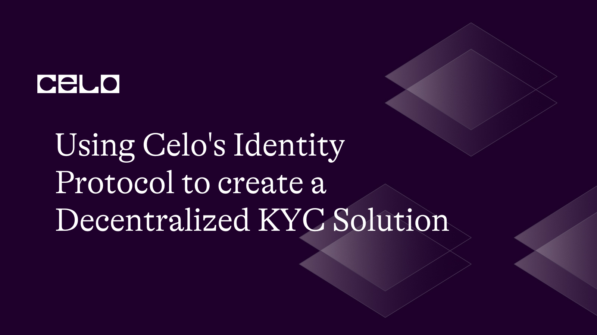
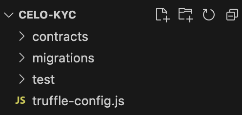
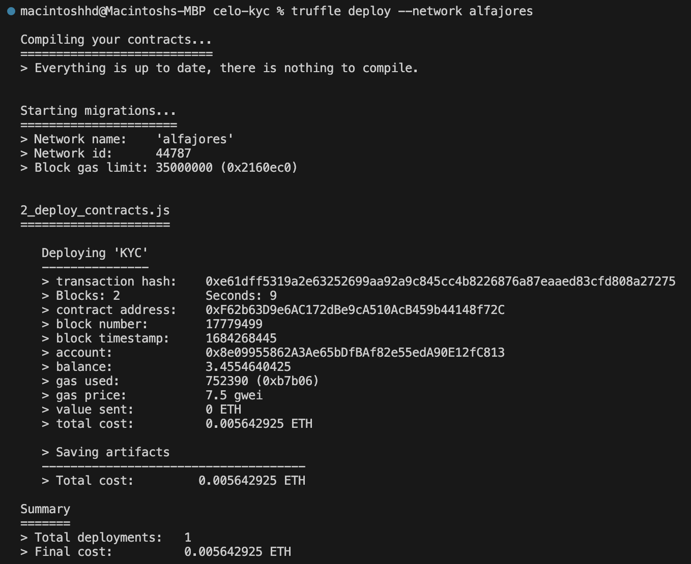

## Introduction

In today's digital world, verifying a user's identity has become crucial for security and compliance. However, traditional Know Your Customer (KYC) processes can be time-consuming and inefficient. Celo's identity protocol offers a decentralized solution, making KYC processes more secure, efficient, and user-friendly. In this tutorial, we'll learn how to create a decentralized KYC solution using Celo's identity protocol.

## Prerequisites

Before diving into this tutorial, make sure you have a basic understanding of blockchain, smart contracts, and the Celo platform. Familiarity with Solidity, JavaScript, and web3 will also be helpful.

## Requirements
- Install Node.js (version 12.0.1 or later).
- Set up a Celo development environment.
- Install a code editor like Visual Studio Code.
- Truffle: This is a popular development framework for building Ethereum-based applications. It allows you to test and deploy on celo. You can install it using npm by running `npm install -g truffle`.

## Building the Decentralized KYC Solution

1. Setting up the project
First, let's create a new directory for our project, navigate to it, and initialize truffle in it. Run the following command in your terminal:

```bash
mkdir celo-kyc && cd celo-kyc
truffle init
```

2. Next, let's install `truffle/hdwallet-provider`. This allows you to sign transactions for addresses derived from a mnemonic. You’ll use this to connect to Celo in your truffle configuration file. Run the command below in your terminal.

```bash
npm install @truffle/hdwallet-provider --save
```

Ensure you run the command above in the root directory of your project.

Open your project in Visual Studio code or your preferred IDE. It should have the following directories/files in it:



### Creating the Smart Contract
1. First, let's create a new file named `KYC.sol` in the contracts directory and write the smart contract code to store and verify user data:

```solidity
//SPDX-License-Identifier: MIT
pragma solidity ^0.8.0;

contract KYC {
    struct UserData {
        string name;
        string documentId;
        bool isVerified;
    }

    mapping(address => UserData) public userData;
    address public admin;

    constructor() {
        admin = msg.sender;
    }

    modifier onlyAdmin() {
        require(msg.sender == admin, "Only admin can perform this action");
        _;
    }

    function addUser(address _user, string memory _name, string memory _documentId) public onlyAdmin {
        userData[_user] = UserData(_name, _documentId, false);
    }

    function verifyUser(address _user) public onlyAdmin {
        userData[_user].isVerified = true;
    }

    function isUserVerified(address _user) public view returns (bool) {
        return userData[_user].isVerified;
    }
}
 ```

This is a Solidity smart contract that represents the core of the decentralized KYC system.
- A `UserData` struct is defined to store user information, including their name, document ID, and whether they are verified.
- A mapping is created to associate user addresses with their `UserData`.
- An admin address variable is used to store the address of the contract creator.
- The constructor sets the admin to the address that deploys the contract.
- A modifier `onlyAdmin` is used to restrict certain functions to be callable only by the admin.
- The `addUser` function allows the admin to add a user with their name and document ID. It sets the `isVerified` flag to false by default.
- The `verifyUser` function enables the admin to mark a user as verified.
- The `isUserVerified` function returns the isVerified status of a user.

2. Create a file named `2_deploy_contracts.js` in the migrations folder and populate it with the code below.

```js
var KYC = artifacts.require("KYC");

module.exports = function (deployer) {
  deployer.deploy(KYC);
};
 ```

The code defines a deployment script for the KYC contract, using the Truffle framework's deployer function. The script specifies that the KYC contract will be deployed, and then calls the deploy function with KYC as its argument to deploy the contract.

### Deploying the Smart Contract

To deploy the smart contract, we need to compile it first. In your terminal, run the following command in the root directory of the project:

```bash
truffle compile
```

This will compile the smart contract and generate the artifacts in the `/build/contracts` directory. You should get an output similar to this:


Next, let's configure Truffle to deploy the smart contract to the Celo network. In the `truffle-config.js` file, add the following code:

```javascript
const HDWalletProvider = require("@truffle/hdwallet-provider");
const mnemonic = "client great south good cement bucket rank free legend green"; // replace with your MNEMONIC

module.exports = {
  networks: {
    local: {
      host: "127.0.0.1",
      port: 7545,
      network_id: "*",
    },
    alfajores: {
      provider: function () {
        return new HDWalletProvider(
          mnemonic,
          "https://alfajores-forno.celo-testnet.org"
        );
      },
      network_id: 44787,
      gas: 20000000,
      deployTimeout: 300000,
      networkCheckTimeout: 300000,
    },
    // Configure your compilers
    compilers: {
      solc: {
        version: "0.8.19", // Fetch exact version from solc-bin (default: truffle's version)
      },
    },
  },
};
```

Replace the mnemonic in the code above with your own Celo account's mnemonic. You can find your mnemonic in your Celo account's settings.

Finally, run the following command in your terminal to deploy the smart contract to the Alfajores Celo network:

```bash
truffle deploy --network alfajores
```

This will deploy your smart contract to the Celo network and output the contract address once the deployment is complete. The terminal output should be similar to this:



Note down the contract address as it would be needed when we want to interact with the smart contract.

### Integrating Celo’s Identity Protocol

1. In the project directory, create a new file named `identity.js`, and install the dependencies below to interact with your smart contract.

```bash
npm install web3 @celo/contractkit
```

2. Import the necessary libraries and connect to the Celo network:

```javascript
const Web3 = require("web3");
const ContractKit = require("@celo/contractkit");
const KYC = require("./build/contracts/KYC.json");

const privateKey =
 "8d3f57ab3f2c08e01cd6c1d29048093061c7ffd4737532868e34043a01b2a7b4"; // replace with your private key
const rpcUrl = "https://alfajores-forno.celo-testnet.org";

const web3 = new Web3(rpcUrl);
const kit = ContractKit.newKitFromWeb3(web3);

const contractAddress = "0xb20DD034caa6eD27AcA1b5e05F8a6b419dc7a953"; // replace with your contract address
const contractInstance = new kit.web3.eth.Contract(KYC.abi, contractAddress);
```

3. Implement the functions for verifying user identities on the blockchain using Celo's identity protocol:

 ```javascript
async function getPhoneNumberIdentifier(address) {
  const accountsWrapper = await kit.contracts.getAccounts();
  return await accountsWrapper.getPhoneNumberIdentifier(address);
}

async function getMetadataURL(address) {
  const accountsWrapper = await kit.contracts.getAccounts();
  return await accountsWrapper.getMetadataURL(address);
}

async function getAttestationStats(phoneNumberIdentifier) {
  const attestationsWrapper = await kit.contracts.getAttestations();
  return await attestationsWrapper.getAttestationStats(phoneNumberIdentifier);
}

async function verifyAddressMapping(address) {
  const identifier = await getPhoneNumberIdentifier(address);
  const { completed, total } = await getAttestationStats(identifier);

  const requiredAttestations = Math.ceil(total * 0.66);
  return completed >= requiredAttestations;
}
 ```

This JavaScript script contains the functions to interact with the Celo identity protocol:

- It imports the necessary libraries, connects to the Celo network, and sets up the smart contract instance.
- The `getPhoneNumberIdentifier` function retrieves the phone number identifier associated with a given address.
- The `getMetadataURL` function gets the metadata URL for a given address.
- The `getAttestationStats` function fetches the attestation statistics for a phone number identifier.
- The `verifyAddressMapping` function checks if a given address has enough attestations to be considered verified.

## Enabling User Access and Control

### Integration with the Smart Contract

The KYC system we've built provides for users to submit their data, such as name and document ID. This data is stored on the Celo blockchain in our KYC smart contract using the addUser function. This process ensures transparency and security, as the data is stored on a decentralized network.
However, at this point, the user's data is stored, but not yet verified. This is where the Celo identity protocol comes in.

### Leveraging Celo's Identity Protocol

In addition to submitting their data to our KYC system, users will also complete a phone number verification process on the Celo network. This involves receiving and confirming attestations, which serve as proof that the user controls the phone number they claim to.
To check if a user's phone number is verified, our KYC application will interact with the Celo identity protocol using the `verifyAddressMapping` function in our JavaScript file (identity.js). This function fetches attestation data from the Celo network and validates it to verify the user's phone number.

### Finalizing User Verification

Once our application confirms that a user's phone number is verified on the Celo network, we can then mark the user as verified in our KYC smart contract using the `verifyUser` function. This marks the completion of the KYC process.
By integrating our smart contract with the Celo identity protocol in this way, we're able to create a decentralized KYC system that not only securely stores user data on the blockchain, but also verifies user identities using the phone number verification feature of the Celo identity protocol.


## Conclusion​

In essence, the Celo identity protocol allows users to link their phone numbers to their Celo account address. The verification of this link happens off-chain through the attestation process, which doesn't involve the KYC smart contract directly.

Congratulations! You've built a decentralized KYC solution using Celo's identity protocol. By leveraging blockchain technology, you've made the identity verification process more secure, efficient, and user-friendly. With this knowledge, you can now explore other use cases and applications for decentralized identity solutions.

## Next Steps​

To continue learning about the Celo platform and further enhance your skills, consider exploring the following resources:
- Dive deeper into Celo's [official documentation](https://docs.celo.org/).
- Learn how to [implement multi-factor authentication](https://docs.celo.org/blog/tutorials/implementing-multi-factor-authentication-on-celos-blockchain-using-smart-contracts) on Celo.

## About the Author​

Abdur-Rahman Olawale is a blockchain developer and a technical writer. Specializing in creating decentralized applications and insightful technical content, Abdur-Rahman Olawale aims to foster understanding and drive innovation within the blockchain community.

## References​

- [Source Code](https://github.com/Lekanolawale/celo_kyc)
- [Celo's Official Documentation](https://docs.celo.org/)
- [Celo's Identity Protocol](https://docs.celo.org/celo-codebase/protocol/identity)
- [Web3.js Documentation](https://web3js.readthedocs.io/en/v1.3.4/)
- [Celo ContractKit Documentation](https://docs.celo.org/developer/contractkit)


